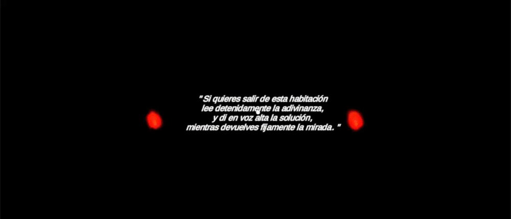
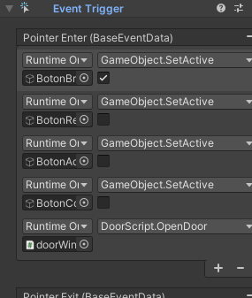
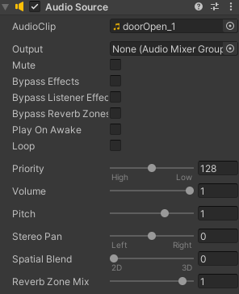
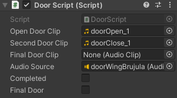

# Interfaces Inteligentes

## Proyecto Final Grupo

## Autores
-  Rafael Cala González - alu0101121901
-  Jorge Acevedo de León - alu0101123622
-  David Valverde Gómez - alu0101100296

## Índice   
1. [Introducción](#id1)
2. [Cuestiones importantes para el uso](#id2)
3. [Escenas](#id3)
4. [Hitos de programación](#id4)
5. [Aspectos a destacar](#id5)
6. [Acta de los acuerdos respecto al trabajo en equipo](#id6)

## Introducción

El **prototipo final** para la asignatura consiste en un juego en **Realidad Virtual** basado en la idea de las populares *scape room*, donde se está encerrado en una habitación y se deben resolver diferentes enigmas y desafíos para conseguir la combinación de la puerta que nos permitirá salir de ella. No obstante, no se ha seguido el diseño de las Scape Room clásicas, sino que hemos optado por hacer el diseño de los mapas enfocados a que cada sala te transporte a un lugar completamente diferente, a fin de darle variedad al juego y lograr que cada diseño se adecúe con lo que se quiere resolver.

Se han mezclado conceptos e ideas recabadas de los años de juegos que acumulamos entre los tres participantes del grupo, repensadas y refactorizadas para aportar una experiencia lo más fresca y novedosa posible.

Se partirá de una **escena principal** con diversas puertas que dirigen a diferentes salas, cada una con un desafío distinto, que utilizan elementos de **Unity** vistos en la asignatura, como brújulas, reconocimiento de voz o gestión de eventos.

Cada sala contará con un pequeño poema a modo de pista que indicará al usuario lo que debe hacer. Cuando se resuelve el desafío de una sala y se vuelve a la escena principal, la puerta relativa a la sala que acabamos de superar desaparecerá, y se mostrará una letra, una vez superadas todas las salas, aparecerá la puerta final, y las letras de cada puerta formarán una palabra que será la clave para abrirla y terminar el juego.

Un punto que vale la pena reseñar es que se ha tratado en todo momento de mantener un equilibrio entre seguir una intuitiva y orientativa interfaz de usuario y ser fiel a la idea de las Scape Room, donde prevalecen los enigmas y los rompecabezas. Así pues, cada detalle introducido en el juego trata de lograr exhaustivamente lo recientemente comentado.

> **NOTA**: En este repositorio se adjunta un video con una demostración de la ejecución del juego en un dispositivo móvil. Cabe destacar que dicho dispositivo presenta problemas previos con la brújula, razón por la que en dicha sala no funciona debidamente

## Cuestiones importantes para el uso

Se ha optado por utilizar la interfaz más natural posible para la interacción con el universo del juego; obligar al usuario a hacer uso de interfaces físicas para jugar dificulta en gran medida su capacidad de inmersión. Se busca que no solo sea sencillo, sino también accesible, por lo que la decisión final ha sido focalizar toda la interacción en el uso de la retícula, evitando así que el usuario se vea anclado al plano terrenal por un mando que sostener en la manos.

Así pues, apuntando la retícula en los elementos del escenario se activarán las interacciones con los objetos que en ese momento estén preparados para ello, de una forma simple e intuitiva. No se requiere que el usuario fije su visión en una parte en concreto, con que la retícula haga un contacto mínimo es suficiente en todos los casos.

De igual manera, para disfrutar completamente la experiencia, es bastante conveniente que el usuario pueda girar sobre sí mismo tanto para poder resolver cómodamente algunos de los niveles como para disponer de una visión total del mapa en el que se sitúa.

Otro aspecto importante a comentar es la necesidad del uso del micrófono, para lo cual se pide permisos de grabación al inicio de la aplicación.

## Escenas

### Menú de inicio

La primera escena que vemos al abrir el juego muestra un **menú inicial** que permite al usuario indicar cuándo desea comenzar a jugar, o salir de la aplicación si es lo que desea. Además, se indica el título y una pequeña 'puesta en situación' del juego.

### Sala general

La **escena principal** del juego tiene lugar en un bosque un tanto tétrico durante la noche, se ve una pequeña *fogata* que aporta luz a la escena y se aprecian las **puertas** que dirigirán a cada desafío, además de la *pista* principal del juego, que indica que se deben realizar todos los desafíos para conseguir la clave y que aparezca la **puerta final**.

Se tiene un total de **cuatro puertas** que, más la puerta final, proporcionarán las 5 letras que forman la clave necesaria para superar el juego.

Como se venía diciendo, tras finalizar las cuatro salas, la palabra quedará visible y aparecerá la puerta final. Solo quedará decir en alto dicha palabra.

### Recolección de libros

El jugador aparece en medio de una biblioteca, donde la primera pista le indica que debe recoger todos los libros rojos dispersos por la habitación. Para ayudar en la búsqueda, se tiene un contador que indica los restantes.

Una vez recogidos todos los libros, una de las estanterías se oculta para mostrar la puerta de retorno a la sala principal.

### Búsqueda de estrellas

Se muestra una playa durante la noche, con una pista en la arena que incita al jugador a buscar las estrellas en el norte. El jugador contará con una **brújula** que le indicará hacia que sentido está mirando, lo que le ayudará a encontrar el norte y, al levantar la vista al cielo, divisará, entre otras constelaciones, la *Osa Mayor*, la cual, una vez apuntada con la retícula, se iluminará de rojo y dará paso a la aparición de la puerta de regreso.

> **NOTA**: Este gif ha sido grabado desde una ejecución en ordenador, por lo que evidentemente la brújula no funciona correctamente.

### Figuras y colores

Se encuentra al jugador en medio del espacio, rodeado de figuras con forma de corazón, estrella y diamante, todas carentes de color. Se tienen 3 figuras, una de cada tipo y cada una de un color; el jugador debe 'tintar' la retícula con uno de estos colores y pintar cada una de las figuras en blanco del color que corresponda, respetando las equivalencias de las figuras grandes.

Una vez completado, todas las figuras se teñirán de un color verde y aparecerá la puerta de salida.

### Resolución de adivinanzas

En esta última sala, nos encontramos en una zona completamente oscura, en la cual se irán encendiendo varias llamas a modo de antorchas. El jugador comienza mirando hacia la pista, que le indica que debe resolver una adivinanza, cuya solución se debe decir en voz alta, mientras *devuelve fijamente la mirada*.

Esto puede resultar un poco confuso en un primer momento, hasta que el usuario busca por la escena y encuentra un ojo gigante mirándole fijamente, con la adivinanza a resolver bajo él.

Tras obtener la solución de la adivinanza, se debe mirar hacia el ojo y pronunciar en voz alta la respuesta. Si es correcta, el ojo desaparecerá y se activará la puerta de regreso.

## Hitos de programación

En relación a los contenidos que se han impartido, se han incluido los siguientes hitos:

### Modificación de las características físicas de los objetos

En diferentes salas se han implementado funciones que cambian cierta característica física de algunos objetos, como su color, o que directamente destruyen el objeto. Los ejemplos más destacados de estos casos son:

* La sala de **Figuras y colores**, en la que se deben *pintar* las figuras en blanco del color correspondiente. Esto es posible cambiando la propiedad **material.color** del componente *Renderer* del objeto en cuestión.

* La sala de **Recolección de libros**, donde desaparecen los libros que son recolectados. Esto simplemente tiene lugar con la función **SetActive** de cada objeto, que es llamada con un valor *false* cuando el libro detecta un evento de tipo **OnPointerEnter**.

* Además, aunque se hablará de esto más adelante, también se modifican ciertas características de **iluminación**, como por ejemplo la *intensidad y el color* de las estrellas relativas a la constelación *Osa Mayor* en la sala **Búsqueda de estrellas**. Esto es posible modificando los atributos **range** y **color** del componente *Light* de cada objeto.

### Eventos

El uso de eventos es el pilar en que se sostenta este proyecto, pues toda acción a realizar debe hacerse apuntando la retícula hacia algún objeto o algún botón. Es por esto que los eventos predominantes son **OnPointerEnter** y **OnPointerExit**.

* **OnPointerEnter** se utiliza para cualquier acción que se desee realizar con la retícula: activar las animaciones de las puertas, pulsar botones o acceder a cualquier objeto.

* **OnPointerExit** se utiliza para activar las animaciones de cerrado de puertas, pues las puertas sólo se cerrarán cuando la retícula deje de apuntar hacia ellas.

Como se aprecia en la imagen, estos eventos se utilizan mediante componentes *Event Trigger*.

### Uso de Google VR

Como es lógico, se ha hecho uso de Google VR para el desarrollo del prototipo. En adición, se han modificado propiedades de la retícula a fin de mejorar la jugabilidad de la aplicación, como es el caso de la sala de **Figuras y colores**, donde la retícula cambia al color asignado actual, como si fuera un pincel.

### Animaciones

Se han implementado animaciones para múltiples elementos del juego, entre ellos las puertas, el ojo, la luna, o el armario, entre algunos otros.
Para cada uno de las animaciones, se implementa un componente *Animator*, en el que se definen las transiciones entre las animaciones definidas para cada objeto; esto se ve ejemplificado de forma clara en el gif que se adjunta a continuación, en el que se enseña el comportamiento del *Animator* de la puerta.

### Iluminación

La iluminación juega un papel importante en algunas de las escenas. El caso más claro es la sala de la **Búsqueda de estrellas**, donde las constelaciones están creadas a partir de puntos de luz, de modo que los que forman la Osa Mayor, son modificados una vez encontrada dicha constelación. Así mismo, se utilizan hogueras y otros puntos de luz en el resto de mapas que ayudan a mejorar la experiencia.

### Sensores
  Para finalizar este apartado, cabe destacar el uso de sensores como:
  -  Brújula
  -  Micrófono (Reconocimiento de voz)
  -  Salida de audio (Reproducción de sonidos)
  
  De esto se hablará en detalle en el apartado siguiente.

## Aspectos a destacar

En este proyecto destacan diferentes aspectos que se consideran de interés para la experiencia de usuario en una aplicación de *Realidad Virtual*:

* Se cuenta con una **pantalla principal** bastante sencilla, pero que da al usuario la oportunidad de iniciar el juego cuando lo desee.

* No se utilizan **colores brillantes** que puedan molestar al usuario.

* Se ha hecho uso de numerosos **assets** de Unity con el fin de conseguir escenas lo más realistas e inmersivas posible.

* Existen diferentes **animaciones** que aportan cierto realismo y dinamismo al juego.

* También se han implementado diferentes **sonidos**, tanto de fondo como cuando se cumple algún objetivo. 

* Por último, se ha implementado un **indicador de carga** entre escenas, de manera que el usuario no piense que el juego se ha bloqueado porque tarde mucho en cargar las escenas.

Además, se han incluido diversos **sensores** trabajados a lo largo de la sección de *Interfaces Multimodales*:

* La **brújula** del dispositivo móvil es utilizada en la sala de *Búsqueda de estrellas*, indica al usuario hacia dónde está mirando y le ayuda a localizar la *Osa Mayor* que se encuentra en el *norte*. Esto se ha conseguido gracias a *Input.compass*.

* Se ha implementado la **reproducción de sonidos** en todas las salas, bien como sonido ambiente o bien activados por la consecución de alguno de los objetivos propuestos. Esto ha sido posible gracias al elemento *Audio Source*, que ha sido añadido a diferentes objetos en todas las escenas, además de los *Audio Clips* que definen el sonido a reproducir.

* El **reconocimiento de voz** se utiliza en diversos momentos del juego:
  - En la sala de *Resolución de adivinanzas* se requiere al jugador que dia en voz alta la respuesta, esto será transformado a texto y se verificará si es la respuesta.
  - En la *sala principal*, una vez superados todos los desafíos y aparezca la **puerta final**, la clave para abrirla también debe ser dicha en voz alta. 

Cabe destacar que, dado que el reconocimiento de voz visto en clase (*Keyword Recognizer*) utiliza una librería de Windows, no es posible implementarlo en una aplicación móvil, por lo que se ha utilizado la librería *Speech And Text*, que permite convertir la voz a texto (y viceversa) tanto en dispositivos **Android** como **IOS**. 

## Acta de los acuerdos respecto al trabajo en equipo

* David Valverde Gómez.

  - Refactorización y mejora del código.
  - Documentación del código.
  - Implementacion completa del reconocimiento de voz.
  - Implementación de la parte del final del juego.
  - Implementación de la opción de salir del juego.
  - Adición de constelaciones a la sala de la búsqueda de estrellas.

* Jorge Acevedo de León.

  - Creación e implementación de las animaciones.
  - Diseño completo de la sala de la Adivinanza.
  - Adición de componentes gráficos que mejoran los diseños de los mapas.
  - Búsqueda de *assets* para la mejora del diseño de cada sala.
  - Adición de constelaciones a la sala de la búsqueda de estrellas.
  - Implementación del *progress tracking* (progreso entre escenas).

* Rafael Cala González.

  - Diseño inicial del mapa central.
  - Diseño base e implementación del menú inicial.
  - Diseño completo de la sala Figuras y Colores.
  - Diseño base de la sala Búsqueda de las estrellas.
  - Búsqueda de *assets* para la mejora del diseño de cada sala.
  - Implementación inicial de la carga de las escenas.

* Tareas en común.

  - Implementación de sonidos (ambientales y de interacción).
  - Diseño conceptual del estilo del juego.
  - Diseño conceptual de cada sala.
  - Desarrollo de las pistas de cada mapa.
  - Idea conceptual del prototipo (tipo Scape Room).
  - Implementación del indicador de carga entre escenas.